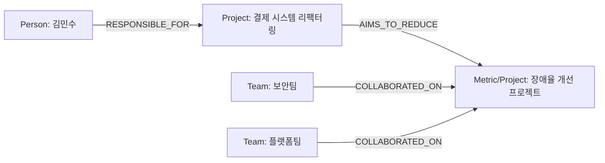

# Neo4j Cypher 쿼리 기초 및 Graph RAG 입문

## 목차
1. [Vector RAG vs Graph RAG 비교](#1-vector-rag-vs-graph-rag-비교)
2. [Neo4j 및 Cypher 기본 개념](#2-neo4j-및-cypher-기본-개념)
3. [Cypher 핵심 문법과 CRUD 실습](#3-cypher-핵심-문법과-crud-실습)
4. [Python 기반 Neo4j 드라이버 연결 (`1_test_connection.py`)](#4-python-기반-neo4j-드라이버-연결-1_test_connectionpy)
5. [LangChain과 Groq를 활용한 지식 그래프 자동 구축 (`2_build_graph.py`)](#5-langchain과-groq를-활용한-지식-그래프-자동-구축-2_build_graphpy)
6. [GraphCypherQAChain을 활용한 Graph RAG 질의 응답 (`3_ask_graph.py`)](#6-graphcypherqachain을-활용한-graph-rag-질의-응답-3_ask_graphpy)
7. [Graph RAG 성능 최적화 및 운영 고려사항](#7-graph-rag-성능-최적화-및-운영-고려사항)
8. [정리](#8-정리)

---

## 1. Vector RAG vs Graph RAG 비교

전통적인 **Vector RAG (Vector-based RAG)**는 텍스트를 청크(Chunk)로 나눈 후 코사인 유사도(Cosine Similarity)를 통해 연관성이 높은 문단을 찾아냅니다. 하지만 다단계 관계 추론(Multi-hop Reasoning)이나 데이터 간의 집계/연결성이 중요한 경우에는 분명한 한계가 존재합니다.

| 구분 | Vector RAG | Graph RAG (GraphDB) |
|---|---|---|
| **검색 방식** | 임베딩 벡터 공간에서의 유사도 기반 검색 (k-NN) | Cypher 쿼리를 통한 노드 및 관계 경로(Path) 탐색 |
| **강점** | 비정형 문맥 검색, 키워드/의미적 유사도 파악에 탁월 | 다단계 추론(Multi-hop), 정교한 복합 관계, 스키마 구조 탐색에 탁월 |
| **약점** | 2-3단계 이상 얽혀 있는 엔티티 간 간접 관계 추론 불가 | 초기 지식 그래프(Knowledge Graph) 데이터 구축 비용 발생 |
| **설명 가능성** | 검색된 텍스트 청크만 확인 가능 (추론 경로 불투명) | 그래프 경로(Path)가 그대로 쿼리로 반환되어 추론 과정의 투명성 확보 |
| **환각(Hallucination)** | 잘못된 텍스트 청크 수집 시 지어낸 답변 위험 높음 | 정확한 그래프 노드/관계 데이터에 기반하므로 답변 환각 최소화 |

---

## 2. Neo4j 및 Cypher 기본 개념

그래프 데이터베이스(Graph Database)는 데이터 간의 관계(Relationship)를 첫 번째 개체(First-class citizen)로 다루어, 복잡하게 연결된 데이터를 직관적이고 빠르게 조작할 수 있는 데이터베이스입니다. Neo4j는 대표적인 그래프 DB이며, 선언형 선형 그래프 쿼리 언어인 **Cypher**를 사용합니다.

### 노드 기본 구성요소 예시

```cypher
MATCH (p:Person {id: '김민수'})
SET p.age = 39
RETURN p.id, p.age;
```

### RDB(관계형 DB)와의 비교

| 구문 요소 | 표준 용어 (Graph DB) | RDB (관계형 DB) 비유 시 | 역할 및 의미 |
|---|---|---|---|
| `Person` | 라벨 (Label) | 테이블명 (Table) | 노드의 종류 및 유형을 지정합니다. |
| `p` | 노드 변수 (Node Variable) | 테이블 별칭 (Alias) | 쿼리 내에서 해당 노드를 참조하기 위한 식별자입니다. |
| `(p:Person)` | 노드 (Node) | 레코드 / 행 (Row) | 그래프 내의 하나의 개체(Entity) 자체를 의미합니다. |
| `{id: '김민수'}` | 속성 (Property) | 컬럼 및 값 (Column/Value) | 노드가 가진 상세 Key-Value 데이터입니다. |

---

## 3. Cypher 핵심 문법과 CRUD 실습

### 1) Create (생성)

#### 노드 생성
```cypher
CREATE (kim:Person {이름: "김민수", 나이: 34})
RETURN kim;
```

#### 다중 노드 생성
```cypher
CREATE 
  (kim:Person {이름: "김민수", 나이: 34}),
  (park:Person {이름: "박상호", 나이: 27}),
  (lee:Person {이름: "이상희", 나이: 32})
RETURN kim, park, lee;
```

#### 노드 및 관계 동시에 생성
```cypher
CREATE
  (kim:Person {이름: "김민수", 나이: 34})
  -[r:RESPONSIBLE_FOR]->
  (refactor:Project {이름: "결제 시스템 리팩터링", 상태: "진행 중"})
RETURN kim, r, refactor;
```

#### 경로(Path) 전체 객체로 반환하며 생성
```cypher
CREATE path =
  (kim:Person {이름: "김민수", 나이: 34})
  -[:RESPONSIBLE_FOR]->
  (refactor:Project {이름: "결제 시스템 리팩터링", 상태: "진행 중"})
RETURN path;
```

---

### 2) Read (조회)

- `()` : 임의의 노드 표현
- `-->` : 방향성을 가진 임의의 관계 표현

#### 모든 관계 조회 / 전체 노드 조회
```cypher
-- 관계가 존재하는 모든 패스 조회
MATCH p = () --> ()
RETURN p;

-- 모든 노드 조회
MATCH n = ()
RETURN n;

-- 종합 조회
MATCH p = (), q = () --> ()
RETURN p, q;
```

#### 특정 라벨 및 조건 필터링
```cypher
-- 특정 라벨 노드의 속성 출력
MATCH (p:Person)
RETURN p.이름, p.나이;

-- WHERE 절을 이용한 속성 조건 필터링
MATCH (p:Person)
WHERE p.나이 >= 30
RETURN p;

-- 문자열 포함(CONTAINS) 및 논리 연산자(AND)
MATCH (p:Person)
WHERE (p.이름 CONTAINS '이상희') AND (p.나이 > 30)
RETURN p;
```

#### 복잡한 그래프 생성 및 서브 그래프 조회
```cypher
-- 1. 복잡한 노드 셋 생성
CREATE
  (kim:Person {이름: "김민수", 나이: 34}),
  (refactor:Project {이름: "결제 시스템 리팩터링", 상태: "진행중"}),
  (improve:Project {이름: "장애율 개선 프로젝트", 상태: "진행중"}),
  (security:Team {이름: "보안팀", 역할: "공동 진행팀"}),
  (platform:Team {이름: "플랫폼팀", 역할: "공동 진행팀"})
RETURN kim, refactor, improve, security, platform;

-- 2. 노드 간 다중 관계 생성
MATCH
  (kim:Person {이름: "김민수"}),
  (refactor:Project {이름: "결제 시스템 리팩터링"}),
  (improve:Project {이름: "장애율 개선 프로젝트"}),
  (security:Team {이름: "보안팀"}),
  (platform:Team {이름: "플랫폼팀"})
CREATE
  (kim)-[r:RESPONSIBLE_FOR]->(refactor),
  (refactor)-[atr:AIMS_TO_REDUCE]->(improve),
  (security)-[co1:COLLABORATES_ON]->(improve),
  (platform)-[co2:COLLABORATES_ON]->(improve)
RETURN kim, refactor, improve, security, platform, r, atr, co1, co2;
```

#### 다단계 경로 탐색 및 최단 경로 (shortestPath)

```cypher
-- 1~5단계 가변 관계 홉(Hop)을 통한 모든 연결 경로 탐색
MATCH (start:Person {이름: "김민수"})
MATCH (end:Team {이름: "보안팀"})
MATCH p = (start)-[*1..5]-(end)
RETURN p;

-- 특정 관계 유형으로만 제한한 N단계 홉 탐색
MATCH (p:Person {id: '김민수'})-[:COLLABORATED_ON|RESPONSIBLE_FOR*1..4]-(t:Team {id: '보안팀'})
RETURN p, t;

-- 두 노드 간 최단 경로(shortestPath) 탐색
MATCH (start:Person {이름: "김민수"})
MATCH (end:Team {이름: "보안팀"})
MATCH p = shortestPath((start)-[*1..10]-(end))
RETURN p;
```

> **패턴 작성 팁**:
> - **관계의 속성을 조건절에 쓰거나 개별 변수가 필요한 경우**: `-[r:TYPE]->` 와 같이 관계 변수를 반드시 지정합니다.
> - **일회성 연결 확인 및 전체 Path 반환 시**: `MATCH path = (...)` 형태로 변수를 묶어서 작성하는 것이 훨씬 깔끔합니다.

---

### 3) Update (수정 및 MERGE)

#### 노드 속성 수정 / 다중 속성 추가 (`+=` 연산자)
```cypher
-- 단일 속성 수정
MATCH (p:Person {id: '김민수'})
SET p.age = 39
RETURN p.id, p.age;

-- 조회 시 Aliasing (AS)
MATCH (p:Person {id: '김민수'})
SET p.age = 39
RETURN p.id AS id, p.type AS type, p.age AS age;

-- 기존 속성을 유지하면서 새로운 속성들만 추가/갱신 (+= 연산자)
MATCH (p:Person {id: '김민수'})
SET p += {age: 39, dept: '개발팀'}
RETURN p;
```

#### MERGE를 활용한 멱등성(Idempotent) 보장 생성/수정
```cypher
-- 노드가 없으면 생성하고 있으면 속성 및 라벨 세팅
MERGE (improve:Entity {id: "장애율 개선 프로젝트"})
SET improve.type = "Project",
    improve.이름 = "장애율 개선 프로젝트"
SET improve:Project
RETURN improve;

-- 관계 MERGE
MATCH (refactor:Project {id: "결제 시스템 리팩터링"})
MATCH (improve:Project {id: "장애율 개선 프로젝트"})
MERGE (refactor)-[ct:CONTRIBUTES_TO]->(improve)
RETURN refactor, improve, ct;
```

---

### 4) Delete (삭제)

```cypher
-- 특정 노드 간 관계 및 노드 삭제
MATCH (:Project {id: "결제 시스템 리팩터링"})-[r:AIMS_TO_REDUCE]->(m:Metric {id: "장애율"})
DELETE r, m;

-- 관계가 얽혀있는 노드를 강제 삭제 (DETACH DELETE)
MATCH (m:Metric {id: "장애율"})
DETACH DELETE m;

-- 전체 데이터베이스 그래프 초기화
MATCH (n)
DETACH DELETE n;
```

---

## 4. Python 기반 Neo4j 드라이버 연결 (`1_test_connection.py`)

Neo4j 데이터베이스와 파이썬 애플리케이션을 연결하는 가장 기본적인 방법은 공식 `neo4j` 파이썬 드라이버 라이브러리를 이용하는 것입니다.

```python
import os
from dotenv import load_dotenv
from neo4j import GraphDatabase

# .env 파일로부터 접속 정보 로드
load_dotenv()

URI = os.getenv("NEO4J_URI")
USERNAME = os.getenv("NEO4J_USERNAME")
PASSWORD = os.getenv("NEO4J_PASSWORD")

# Neo4j 드라이버 인스턴스 생성
driver = GraphDatabase.driver(URI, auth=(USERNAME, PASSWORD))

try:
    # 데이터베이스 연결 통신 검증
    driver.verify_connectivity()
    print("Neo4j 연결 성공!")
finally:
    # 드라이버 자원 해제
    driver.close()
```

---

## 5. LangChain과 Groq를 활용한 지식 그래프 자동 구축 (`2_build_graph.py`)

비정형 자연어 텍스트로부터 지식 그래프(Knowledge Graph)를 구축하기 위해, Pydantic으로 추출할 그래프 스키마(노드와 관계)를 정적 타입으로 정의하고, Groq LLM(`llama-3.3-70b-versatile`)의 Structured Output 기능 및 LangChain Neo4j 연동 파이프라인을 사용합니다.

### 구축되는 그래프 구조 네트워크 다이어그램



### 지식 그래프 구축 코드

```python
import os
import json
from typing import Literal

from dotenv import load_dotenv
from pydantic import BaseModel, Field

from langchain_groq import ChatGroq
from langchain_neo4j import Neo4jGraph


load_dotenv()

NEO4J_URI = os.getenv("NEO4J_URI")
NEO4J_USERNAME = os.getenv("NEO4J_USERNAME")
NEO4J_PASSWORD = os.getenv("NEO4J_PASSWORD")
GROQ_MODEL = os.getenv("GROQ_MODEL", "llama-3.3-70b-versatile")


# 1. Pydantic을 이용한 추출 스키마 정의
class KGNode(BaseModel):
    id: str = Field(description="노드 이름. 예: 김민수, 결제 시스템 리팩터링")
    type: Literal["Person", "Project", "Team", "Metric", "System", "Unknown"]


class KGRelationship(BaseModel):
    source: str = Field(description="출발 노드 id")
    target: str = Field(description="도착 노드 id")
    kind: Literal[
        "RESPONSIBLE_FOR",
        "AIMS_TO_REDUCE",
        "COLLABORATED_ON",
        "RELATED_TO",
    ]


class KGGraph(BaseModel):
    nodes: list[KGNode]
    relationships: list[KGRelationship]


# 2. Neo4jGraph 및 LLM 구조체 바인딩
graph = Neo4jGraph(
    url=NEO4J_URI,
    username=NEO4J_USERNAME,
    password=NEO4J_PASSWORD,
    database=os.getenv("NEO4J_DATABASE"),
)

llm = ChatGroq(
    model=GROQ_MODEL,
    temperature=0,
)

structured_llm = llm.with_structured_output(KGGraph)

# 3. 비정형 자연어 텍스트
text = """
김민수는 결제 시스템 리팩터링을 담당했다.
결제 시스템 리팩터링은 장애율을 낮추기 위한 프로젝트였다.
결제 시스템 리팩터링은 보안팀과 플랫폼팀이 공동으로 진행했다.
"""

prompt = f"""
다음 한국어 문장에서 지식 그래프를 추출하세요.

규칙:
- 문장에 명시된 정보만 사용하세요.
- 노드는 중요한 사람, 프로젝트, 팀, 지표, 시스템을 추출하세요.
- 관계는 가능한 한 아래 중 하나를 사용하세요:
  - RESPONSIBLE_FOR: 사람이 프로젝트나 업무를 담당함
  - AIMS_TO_REDUCE: 프로젝트가 어떤 지표를 낮추는 목적을 가짐
  - COLLABORATED_ON: 팀이 프로젝트를 공동 진행함
  - RELATED_TO: 위 관계로 표현하기 어려운 일반 관계
- relationship의 source와 target은 반드시 nodes의 id 중 하나여야 합니다.

문장:
{text}
"""

# LLM으로 구조화된 KG 추출 실행
kg = structured_llm.invoke(prompt)

print("LLM 추출 결과:")
print(json.dumps(kg.model_dump(), ensure_ascii=False, indent=2))


# 4. Neo4j DB 저장 (유니크 제약 조건 생성 및 UNWIND + MERGE 대량 저장)
graph.query("""
CREATE CONSTRAINT entity_id_unique IF NOT EXISTS
FOR (e:Entity)
REQUIRE e.id IS UNIQUE
""")

nodes = [node.model_dump() for node in kg.nodes]
relationships = [rel.model_dump() for rel in kg.relationships]

# 노드 멱등적 저장
graph.query(
    """
    UNWIND $nodes AS node
    MERGE (e:Entity {id: node.id})
    SET e.type = node.type
    """,
    params={"nodes": nodes},
)

# GraphCypherQAChain 조회를 돕기 위한 서브 라벨 동적 동기화
for node_type in ["Person", "Project", "Team", "Metric", "System", "Unknown"]:
    graph.query(
        f"""
        MATCH (e:Entity {{type: $node_type}})
        SET e:{node_type}
        """,
        params={"node_type": node_type},
    )

# 관계 멱등적 저장
for kind in [
    "RESPONSIBLE_FOR",
    "AIMS_TO_REDUCE",
    "COLLABORATED_ON",
    "RELATED_TO",
]:
    graph.query(
        f"""
        UNWIND $relationships AS rel
        WITH rel
        WHERE rel.kind = $kind
        MATCH (source:Entity {{id: rel.source}})
        MATCH (target:Entity {{id: rel.target}})
        MERGE (source)-[r:{kind}]->(target)
        """,
        params={"relationships": relationships, "kind": kind},
    )

print("그래프 생성 완료!")
```

### 🔥 Pydantic AI(pydantic-ai) 기반 지식 그래프 추출 풀 코드 리팩토링

최신 LLM 에이전트 프레임워크인 **Pydantic AI**를 활용하면 LangChain의 `ChatGroq` ➡️ `with_structured_output` ➡️ `invoke` 체인 구조를 단 한 줄의 `Agent('groq:...', result_type=KGGraph)` 선언으로 간결하고 안전하게 대체할 수 있습니다.

```python
import os
import json
from typing import Literal

from dotenv import load_dotenv
from pydantic import BaseModel, Field
from pydantic_ai import Agent                # 👈 최신 Pydantic AI
from neo4j import GraphDatabase              # 👈 공식 Neo4j 드라이버

load_dotenv()

# 1. Pydantic 스키마 정의
class KGNode(BaseModel):
    id: str = Field(description="노드 이름")
    type: Literal["Person", "Project", "Team", "Metric", "System", "Unknown"]

class KGRelationship(BaseModel):
    source: str = Field(description="출발 노드 id")
    target: str = Field(description="도착 노드 id")
    kind: Literal["RESPONSIBLE_FOR", "AIMS_TO_REDUCE", "COLLABORATED_ON", "RELATED_TO"]

class KGGraph(BaseModel):
    nodes: list[KGNode]
    relationships: list[KGRelationship]

# 2. Graph Pruning 후처리 함수
def validate_kg(kg: KGGraph) -> KGGraph:
    node_ids = {node.id for node in kg.nodes}
    valid_relationships = [r for r in kg.relationships if r.source in node_ids and r.target in node_ids]
    return KGGraph(nodes=kg.nodes, relationships=valid_relationships)

# 3. Pydantic AI Agent 선언 (result_type에 KGGraph 지정)
kg_agent = Agent(
    'groq:llama-3.3-70b-versatile',
    result_type=KGGraph,  # 👈 반환받을 Pydantic 구조체 지정!
    system_prompt="""
    당신은 한국어 문장에서 노드와 관계를 파싱하는 지식 그래프 추출 AI입니다.
    규칙:
    - 노드는 사람, 프로젝트, 팀, 지표, 시스템을 추출하세요.
    - 관계 방향 규칙:
      - RESPONSIBLE_FOR: Person -> Project
      - AIMS_TO_REDUCE: Project -> Metric
      - COLLABORATED_ON: Team -> Project
    """
)

# 4. 실행 (단 한 줄로 타입 안정성이 보장된 결과 수신!)
text = """
김민수는 결제 시스템 리팩터링을 담당했다.
결제 시스템 리팩터링은 장애율을 낮추기 위한 프로젝트였다.
결제 시스템 리팩터링은 보안팀과 플랫폼팀이 공동으로 진행했다.
"""

result = kg_agent.run_sync(f"다음 문장에서 지식 그래프를 추출하세요:\n{text}")
clean_kg: KGGraph = validate_kg(result.data)  # 👈 result.data는 이미 KGGraph 객체!

print("Pydantic AI 추출 결과:")
print(json.dumps(clean_kg.model_dump(), ensure_ascii=False, indent=2))

# 5. Neo4j DB 저장 (공식 드라이버 사용)
driver = GraphDatabase.driver(os.getenv("NEO4J_URI"), auth=(os.getenv("NEO4J_USERNAME"), os.getenv("NEO4J_PASSWORD")))
nodes = [node.model_dump() for node in clean_kg.nodes]
relationships = [rel.model_dump() for rel in clean_kg.relationships]

with driver.session(database=os.getenv("NEO4J_DATABASE", "neo4j")) as session:
    session.run("CREATE CONSTRAINT entity_id_unique IF NOT EXISTS FOR (e:Entity) REQUIRE e.id IS UNIQUE")
    session.run(
        """
        UNWIND $nodes AS node
        MERGE (e:Entity {id: node.id})
        SET e.name = node.id, e.type = node.type
        """,
        nodes=nodes
    )
    for node_type in ["Person", "Project", "Team", "Metric", "System", "Unknown"]:
        session.run(f"MATCH (e:Entity {{type: $node_type}}) SET e:{node_type}", node_type=node_type)
    for kind in ["RESPONSIBLE_FOR", "AIMS_TO_REDUCE", "COLLABORATED_ON", "RELATED_TO"]:
        session.run(
            """
            UNWIND $relationships AS rel
            WITH rel WHERE rel.kind = $kind
            MATCH (source:Entity {id: rel.source})
            MATCH (target:Entity {id: rel.target})
            MERGE (source)-[r:RESPONSIBLE_FOR|AIMS_TO_REDUCE|COLLABORATED_ON|RELATED_TO]->(target)
            """,
            relationships=relationships
        )

driver.close()
print("Pydantic AI 그래프 DB 구축 완료!")
```

---

## 6. GraphCypherQAChain을 활용한 Graph RAG 질의 응답 (`3_ask_graph.py`)

지식 그래프 데이터베이스 구축이 완료되면, 자연어 질문을 입력받아 **Cypher 쿼리로 자동 변환**한 뒤 Neo4j 조회를 거쳐 LLM이 최종 답변을 생성하는 Graph RAG 파이프라인(`GraphCypherQAChain`)을 구성합니다.

```python
import os
from dotenv import load_dotenv

from langchain_groq import ChatGroq
from langchain_neo4j import Neo4jGraph, GraphCypherQAChain

load_dotenv()

GROQ_MODEL = os.getenv("GROQ_MODEL", "llama-3.3-70b-versatile")

# Neo4jGraph 연결 설정
graph = Neo4jGraph(
    url=os.getenv("NEO4J_URI"),
    username=os.getenv("NEO4J_USERNAME"),
    password=os.getenv("NEO4J_PASSWORD"),
    database=os.getenv("NEO4J_DATABASE"),
)

# DB 스키마 최신화
graph.refresh_schema()

llm = ChatGroq(
    model=GROQ_MODEL,
    temperature=0,
)

# GraphCypherQAChain 생성
chain = GraphCypherQAChain.from_llm(
    llm=llm,
    graph=graph,
    verbose=True,           # 디버깅용 내부 체인 실행 로깅
    validate_cypher=True,   # LLM 생성 Cypher 쿼리 문법 검증
    allow_dangerous_requests=True,
)

print("Graph schema:")
print(graph.schema)

questions = [
    "김민수와 보안팀은 어떤 관계야?",
]

for question in questions:
    print("\n질문:", question)
    result = chain.invoke({"query": question})
    print("답변:", result["result"])
```

### `verbose=True` 디버깅 옵션의 4단계 실시간 동작 흐름

`verbose=True`로 설정하면 터미널 상에서 `GraphCypherQAChain` 내부의 전체 처리 프로세스를 명확하게 확인할 수 있습니다.

1. **질문 입력 수신**: 사용자가 전달한 자연어 질문 수신 (예: `"김민수와 보안팀은 어떤 관계야?"`)
2. **Cypher 쿼리 생성 로그**: Neo4j 그래프 스키마 정보를 기반으로 LLM이 생성한 Cypher 문장 반환
   - 예시 생성 쿼리:
     ```cypher
     MATCH (p:Person {id: '김민수'})-[:RESPONSIBLE_FOR]->(proj:Project)<-[:COLLABORATED_ON]-(t:Team {id: '보안팀'})
     RETURN proj.id AS project, t.id AS team
     ```
3. **Graph DB 실행 결과 (Raw Data)**: Neo4j에 위 Cypher 쿼리를 실행하여 얻은 결과 데이터 반환
4. **최종 자연어 응답 생성**: Raw DB 데이터를 전달받은 LLM이 사용자 질문에 대답하는 자연어 최종 문장 작성

### 🔥 Pydantic AI(pydantic-ai) Agent + Custom Tool 질의 응답 리팩토링

LangChain의 `GraphCypherQAChain` 대신 Pydantic AI의 `@agent.tool`을 활용하면, 에이전트가 직접 DB 스키마를 조회하고 인젝션 검증이 완료된 Cypher 쿼리를 안전하게 수행하는 **투명하고 강력한 커스텀 에이전트 파이프라인**을 작성할 수 있습니다.

```python
import os
from dotenv import load_dotenv
from neo4j import GraphDatabase
from pydantic_ai import Agent, RunContext

load_dotenv()

# Neo4j 파이썬 드라이버 수동 연결
driver = GraphDatabase.driver(
    os.getenv("NEO4J_URI"),
    auth=(os.getenv("NEO4J_USERNAME"), os.getenv("NEO4J_PASSWORD"))
)

# Pydantic AI Agent 생성
graph_agent = Agent(
    'groq:llama-3.3-70b-versatile',
    system_prompt="""
    당신은 Neo4j 그래프 데이터베이스 기반 질문 응답 AI 에이전트입니다.
    1. 먼저 get_db_schema 툴을 호출하여 DB 노드 라벨과 관계 스키마를 확인하세요.
    2. 질문에 필요한 데이터를 가져오기 위해 execute_cypher 툴로 READ(MATCH) 쿼리를 실행하세요.
    3. 조회된 결과를 바탕으로 사용자에게 자연스러운 답변을 제공하세요.
    """
)

@graph_agent.tool
def get_db_schema(ctx: RunContext) -> str:
    """Neo4j 그래프 데이터베이스의 스키마 메타데이터를 반환합니다."""
    return "Node Labels: Person, Project, Team, Metric\nRelationships: RESPONSIBLE_FOR, AIMS_TO_REDUCE, COLLABORATED_ON"

@graph_agent.tool
def execute_cypher(ctx: RunContext, cypher_query: str) -> list[dict]:
    """Neo4j 데이터베이스에 조회를 위한 MATCH Cypher 쿼리를 실행합니다."""
    # 파괴적/쓰기 쿼리 방지 안전 검증
    forbidden_keywords = ["DELETE", "DETACH", "DROP", "CREATE", "SET"]
    if any(kw in cypher_query.upper() for kw in forbidden_keywords):
        raise ValueError("안전을 위해 쓰기 및 삭제 쿼리는 허용되지 않습니다.")
    
    with driver.session() as session:
        result = session.run(cypher_query)
        return [record.data() for record in result]

# 에지 실행
response = graph_agent.run_sync("김민수와 보안팀은 어떤 관계야?")
print("최종 Pydantic AI 답변:", response.data)
```

---

## 7. Graph RAG 성능 최적화 및 운영 고려사항

운영 환경(Production)에서 Graph RAG 시스템을 안정적이고 빠르게 구축하기 위한 세 가지 핵심 포인트입니다.

### 1) 제약 조건(Constraints)과 인덱스(Indexes)의 필수 설정
데이터 양이 늘어날수록 `MERGE` 구문 및 탐색 쿼리의 속도가 저하될 수 있습니다. 엔티티 식별자 키에 대한 `UNIQUE CONSTRAINT` 설정은 필수입니다.
```cypher
CREATE CONSTRAINT entity_id_unique IF NOT EXISTS
FOR (e:Entity) REQUIRE e.id IS UNIQUE;
```

### 2) 대용량 파라미터 처리 (`UNWIND` 배치 실행)
개별 노드마다 `CREATE`나 `MERGE` 쿼리를 매번 네트워크 통신으로 호출하는 대신, `UNWIND` 절을 통해 파이썬 리스트 형태의 파라미터를 단일 트랜잭션으로 대량 조작하는 것이 수십 배 이상 빠른 작성 속도를 보장합니다.

### 3) Cypher 문법 검증 및 안전 제어 (`validate_cypher` & `allow_dangerous_requests`)
- `validate_cypher=True`: LLM이 생성해낸 Cypher 문장에 존재하지 않는 라벨이나 문법적 실수가 있을 경우, 이를 내부적으로 감지하고 바로잡는 루틴을 지원합니다.
- `allow_dangerous_requests=True`: Neo4j 그래프에 직접 읽기/쓰기를 수반하는 쿼리 실행을 체인에 허용할 때 명시하는 보안 설정 옵션입니다.

---

## 8. 정리

1. **Vector RAG vs Graph RAG**: 복잡한 엔티티 간 연결 관계나 다단계 추론(Multi-hop)이 필요한 시스템에는 Graph RAG가 월등히 우수한 추론력과 설명 가능성(Explainability)을 선사합니다.
2. **Neo4j Cypher 쿼리**: 노드(`Node`), 라벨(`Label`), 관계(`Relationship`), 속성(`Property`) 개념을 이해하고 `MATCH`, `CREATE`, `MERGE`, `SET`, `DELETE` 구문을 구사할 수 있습니다.
3. **LLM 기반 KG 자동 추출**: Pydantic의 `with_structured_output`과 Neo4j의 `UNWIND` + `MERGE` 구문을 결합하여 멱등성 있는 지식 그래프 구축을 완전 자동화할 수 있습니다.
4. **GraphCypherQAChain**: 자연어 질문을 실시간 Cypher로 변환하여 DB 데이터를 실시간 탐색하고 환각이 제거된 자연어 답변을 안정적으로 제공합니다.
