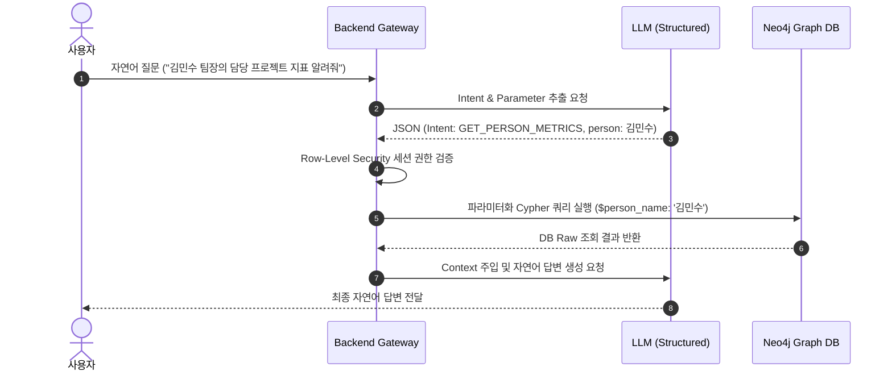
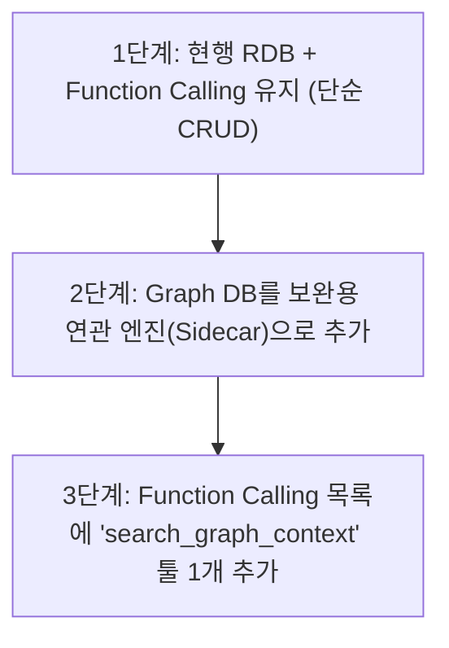

# GraphRAG 및 지식 그래프 실무 엔터프라이즈 아키텍처 설계

## 목차
1. [LLM 지식 그래프 추출 및 관계 생성 원리](#1-llm-지식-그래프-추출-및-관계-생성-원리)
2. [동적 Cypher 생성(Text-to-Cypher)의 실무 환경 한계](#2-동적-cypher-생성text-to-cypher의-실무-환경-한계)
3. [실무 권장 패턴 1: Intent Recognition + Parameterized Cypher Template](#3-실무-권장-패턴-1-intent-recognition--parameterized-cypher-template)
4. [실무 권장 패턴 2: Subgraph RAG / Hybrid Retrieval (Vector + Graph)](#4-실무-권장-패턴-2-subgraph-rag--hybrid-retrieval-vector--graph)
5. [패턴 비교 및 실무 구축 로드맵](#5-패턴-비교-및-실무-구축-로드맵)
6. [운영 서버 Graph DB 인프라 구축 방식 및 비용 비교 (AWS / Cloud)](#6-운영-서버-graph-db-인프라-구축-방식-및-비용-비교-aws--cloud)
7. [EC2 백업 배치(Crontab) 자동화 및 장애 복구(DR) 실무 가이드](#7-ec2-백업-배치crontab-자동화-및-장애-복구dr-실무-가이드)
8. [쿼리 템플릿 방식에서도 RDB 대신 Graph DB를 선택해야 하는 4가지 본질적 이유](#8-쿼리-템플릿-방식에서도-rdb-대신-graph-db를-선택해야-하는-4가지-본질적-이유)
9. [RDB + Function Calling에서 Graph DB로의 전환 타이밍 & 하이브리드 전환 로드맵](#9-rdb--function-calling에서-graph-db로의-전환-타이밍--하이브리드-전환-로드맵)
10. [대규모 Intent 분류를 위한 시맨틱 라우터(Semantic Router) 고도화 아키텍처](#10-대규모-intent-분류를-위한-시맨틱-라우터semantic-router-고도화-아키텍처)
11. [메인 RDS ➡️ Graph DB 데이터 동기화 방식 & 추가 비용 분석](#11-메인-rds-➡️-graph-db-데이터-동기화-방식--추가-비용-분석)
12. [정리](#12-정리)

---

## 1. LLM 지식 그래프 추출 및 관계 생성 원리

비정형 자연어 텍스트로부터 노드(Node)와 관계(Relationship)를 파싱하는 핵심 동력은 **LLM의 문맥 이해 및 자율 판단 능력**에 기반합니다. 하지만 실무 시스템에서는 무제한적인 자유 생성을 허용하지 않고, **Pydantic 스키마와 프롬프트 제약 조건**을 통해 엄격하게 통제합니다.

### 지식 그래프 추출 4단계 통제 메커니즘

1. **Pydantic 스키마 제약**: `KGRelationship`의 `kind` 필드에 `Literal["RESPONSIBLE_FOR", "AIMS_TO_REDUCE", ...]`와 같이 허용 가능한 관계 종류를 정적으로 한정합니다.
2. **프롬프트 가이드라인**: 관계의 세부 의미와 화살표 방향 예시(예: `Person -> Project`)를 제공하여 주어-목적어 관계에 맞춰 방향을 설정하도록 유도합니다.
3. **Structured Output**: `llm.with_structured_output(KGGraph)`를 적용하여 일관된 규격의 JSON 파싱 객체 형태로 반환받습니다.
4. **Graph Pruning (후처리)**: 추출된 관계 중 `source`와 `target`이 실제 존재하는 노드 목록에 모두 포함되는 유효한 연관관계만 파이썬 로직으로 검증하고 걸러냅니다.

```python
from typing import Literal
from pydantic import BaseModel, Field

class KGRelationship(BaseModel):
    source: str = Field(description="출발 노드 id")
    target: str = Field(description="도착 노드 id")
    kind: Literal[
        "RESPONSIBLE_FOR",  # Person -> Project
        "AIMS_TO_REDUCE",   # Project -> Metric
        "COLLABORATED_ON",  # Team -> Project
        "RELATED_TO"        # General Relationship
    ]
```

---

## 2. 동적 Cypher 생성(Text-to-Cypher)의 실무 환경 한계

`GraphCypherQAChain`처럼 사용자의 질문을 입력받아 LLM이 즉석에서 Cypher 쿼리를 생성하고 DB에 전송하는 방식은 **PoC 및 프로토타입 연구 개발**에는 적합하지만, **기업용 실무 데이터베이스 인프라 환경에서는 심각한 4대 위험 요소**가 존재합니다.

### 실무 도입 시 4대 위험 요소

1. **보안 & 권한 관리 결여 (Security & Auth)**:
   - Cypher Injection 위험이 존재합니다.
   - 사용자별/부서별 데이터 접근 권한(Row/Node Level Security)을 LLM에 온전히 일임할 경우 타 부서의 보안 데이터가 유출될 수 있습니다.
2. **쿼리 부하 & DB 다운 위험 (Resource Exhaustion)**:
   - 수백만 노드의 대규모 그래프에서 LLM이 바운더리를 지정하지 않은 무제한 트래버스(예: `MATCH (a)-[*1..10]->(b)`)를 실행할 경우 DB 메모리가 고갈되어 운영 서비스 전체가 다운될 수 있습니다.
3. **환각(Hallucination) 및 쿼리 에러**:
   - 스키마가 복잡해질수록 존재하지 않는 노드 라벨이나 속성명을 지어내어 런타임 구문 오류 발생 빈도가 급증합니다.
4. **결과 비일관성 (Non-Deterministic)**:
   - 동일한 질문("김민수의 담당 프로젝트")에 대해서도 생성되는 Cypher가 매번 조금씩 변형되어 결과와 응답 속도가 일정하지 않습니다.

---

## 3. 실무 권장 패턴 1: Intent Recognition + Parameterized Cypher Template

기업용 환경에서 가장 권장하는 **보안성 100% 보장 정석 패턴**입니다. LLM에게 Cypher 문장 전체 작성을 맡기지 않고, **의도(Intent) 분류 및 매개변수(Parameter) 추출**만 수행하게 한 후, 백엔드에서 사전 검증된 파라미터화 템플릿 쿼리를 안전하게 실행합니다.



### 파이프라인 구현 예시

#### 1. Intent 및 Parameter 파싱 (Python Pydantic)

```python
from typing import Literal, Optional
from pydantic import BaseModel, Field

class UserQueryIntent(BaseModel):
    intent: Literal[
        "GET_PERSON_PROJECT_METRICS",
        "GET_TEAM_COLLABORATORS",
        "SEARCH_PROJECT_STATUS"
    ] = Field(description="질문의 핵심 의도 분류")
    
    person_name: Optional[str] = Field(None, description="인물 이름")
    project_name: Optional[str] = Field(None, description="프로젝트명")
    metric_name: Optional[str] = Field(None, description="지표명 (예: 장애율, 매출 등)")
```

#### 2. 백엔드 세션 검증 & 파라미터화 템플릿 실행

```python
# 개발자가 사전에 검증 및 인덱싱 처리해둔 Cypher 템플릿 맵
QUERY_TEMPLATES = {
    "GET_PERSON_PROJECT_METRICS": """
        MATCH (p:Person {name: $person_name})-[:RESPONSIBLE_FOR]->(proj:Project)
        OPTIONAL MATCH (proj)-[:AIMS_TO_REDUCE]->(m:Metric)
        RETURN proj.name AS project, m.id AS metric
    """,
    "GET_TEAM_COLLABORATORS": """
        MATCH (t:Team {id: $team_name})-[:COLLABORATED_ON]->(proj:Project)
        RETURN proj.name AS project
    """
}

def execute_user_query(parsed_intent: UserQueryIntent, user_context: UserContext):
    # 1. Row-level Security 세션 권한 검증
    if not user_context.has_permission(parsed_intent.person_name):
        raise PermissionError("해당 데이터에 대한 접근 권한이 없습니다.")
        
    # 2. 미리 등록된 안전한 Cypher 템플릿 바인딩
    cypher_query = QUERY_TEMPLATES[parsed_intent.intent]
    
    # 3. 파라미터를 안전하게 전달하여 실행 (Cypher Injection 100% 방지)
    result = graph.query(cypher_query, params={
        "person_name": parsed_intent.person_name
    })
    return result
```

---

## 4. 실무 권장 패턴 2: Subgraph RAG / Hybrid Retrieval (Vector + Graph)

질문의 종류가 너무 다양하여 정형화된 쿼리 템플릿만으로 모두 대응하기 어려울 때 사용하는 **하이브리드 GraphRAG 패턴**입니다. 질문에서 핵심 엔티티 노드를 먼저 식별하고, 인접한 **서브그래프(1~2 Hop)**를 텍스트 Context로 추출하여 LLM 프롬프트에 주입합니다.

```python
# 1~2 Hop 이내의 범위로 탐색을 철저히 제약하는 안전한 쿼리
SUBGRAPH_SEARCH_QUERY = """
    MATCH (source:Entity) WHERE source.id IN $node_ids
    MATCH path = (source)-[r*1..2]-(target:Entity)
    RETURN path
    LIMIT 50
"""

def ask_subgraph_rag(user_question: str):
    # 1. 엔티티 노드 식별 (예: ["김민수", "보안팀"])
    target_nodes = extract_entities(user_question)
    
    # 2. 서브그래프 경로 추출
    paths = graph.query(SUBGRAPH_SEARCH_QUERY, params={"node_ids": target_nodes})
    
    # 3. 서브그래프 패스 데이터를 LLM 텍스트 문맥으로 변환
    # 예: "김민수 --[RESPONSIBLE_FOR]--> 결제 시스템 리팩터링 <--[COLLABORATED_ON]-- 보안팀"
    context_text = format_paths_to_text(paths)
    
    # 4. LLM에 Context와 함께 질문 전달
    prompt = f"""
    다음 그래프 지식을 참고하여 질문에 대답하세요.
    [지식]:
    {context_text}

    [질문]:
    {user_question}
    """
    return llm.invoke(prompt)
```

---

## 5. 패턴 비교 및 실무 구축 로드맵

| 구분 | 동적 Cypher 생성 (Chain) | 패턴 1: Intent + Template | 패턴 2: Subgraph RAG |
|---|---|---|---|
| **주요 용도** | PoC, 연구용 대시보드 | **기업 실무 및 핵심 업무 시스템 (권장)** | 복잡한 사내 지식인 검색 (RAG) |
| **보안성 / 권한 제어** | ❌ 취약 (권한 처리 어려움) | **✅ 완벽 (백엔드 세션 권한 적용)** | **✅ 우수 (조회 범위 제한)** |
| **DB 부하 영향** | ❌ 예측 불가 (Full Scan 위험) | **✅ 인덱싱 최적화 쿼리 보장** | **✅ Hop/Limit 제한으로 안정적** |
| **질문 유연성** | ✅ 매우 높음 | ⚠️ 정의된 Intent 범위 내 | ✅ 높음 |
| **추천 환경** | 프로토타입, 내부 연구 개발 | **엔터프라이즈 실무 업무 시스템** | 사내 AI 지식검색, 문서 RAG |

---

## 6. 운영 서버 Graph DB 인프라 구축 방식 및 비용 비교 (AWS / Cloud)

하이브리드 GraphRAG를 실제 프로덕션 환경에 배포할 때 고려할 수 있는 3가지 핵심 배포 옵션과 비용 및 특징 대조표입니다.

| 항목 | 옵션 A: AWS EC2 (Docker Self-Hosted) | 옵션 B: Neo4j AuraDB (SaaS) | 옵션 C: AWS Neptune |
|---|---|---|---|
| **예상 월 비용** | **\$30 ~ \$70 / 월 (최저)** | **\$65 ~ \$130 / 월 (보통)** | **\$180 ~ \$400+ / 월 (고가)** |
| **인프라 공수** | ⚠️ 직접 백업/패치 구성 필요 | **✅ 0% (완전 자동 관리)** | **✅ 0% (AWS 완전 관리)** |
| **Neo4j APOC / Vector** | **✅ 완벽 지원** | **✅ 완벽 지원** | ⚠️ openCypher 일부 제약 |
| **추천 상황** | **비용 최우선 / 초기 스타트업** | **운영 공수 최소화 / 빠른 출시** | 대규모 엔터프라이즈 / AWS 단일화 |

### AWS EC2 Docker Compose 구성 예시 (`docker-compose.yml`)

```yaml
version: '3.8'
services:
  neo4j:
    image: neo4j:5.18.0-community
    container_name: neo4j-production
    restart: always
    ports:
      - "7474:7474"  # HTTP Browser
      - "7687:7687"  # Bolt protocol
    environment:
      - NEO4J_AUTH=neo4j/YourStrongPassword123!
      - NEO4J_dbms_memory_pagecache_size=2G
      - NEO4J_dbms_memory_heap_initial__size=1G
      - NEO4J_dbms_memory_heap_max__size=2G
    volumes:
      - ./data:/data
      - ./logs:/logs
      - ./plugins:/plugins
```

---

## 7. EC2 백업 배치(Crontab) 자동화 및 장애 복구(DR) 실무 가이드

### 3대 장애 상황별 조치 방안

- **상황 A. Neo4j 컨테이너 OOM 다운**:
  - `restart: always` 옵션 설정으로 Docker가 수 초 내 자동 재시작됩니다.
- **상황 B. 잘못된 DELETE 등 데이터 오염**:
  - S3에 자동 보관된 최신 덤프 파일로 롤백(Rollback) 복구 스크립트를 1회 실행합니다.
- **상황 C. EC2 인스턴스 물리 서버 다운**:
  - 새 EC2 생성 → Docker Compose 실행 → S3 백업 복원 스크립트로 5~10분 내 인프라 전체 복구가 가능합니다.

### 1) 백업 스크립트 (`backup.sh`)

```bash
#!/bin/bash
# 매일 지정된 시각에 Neo4j 덤프 작성 및 S3 자동 업로드
DATE=$(date +%Y%m%d_%H%M%S)
BACKUP_DIR="/home/ubuntu/neo4j_backups"

mkdir -p $BACKUP_DIR

# 1. Neo4j Docker 내부 덤프 생성
docker exec neo4j-production neo4j-admin database dump neo4j --to-path=/data/dumps

# 2. S3 버킷으로 자동 업로드
aws s3 cp /data/dumps/neo4j.dump s3://my-company-graph-backup/neo4j_$DATE.dump

# 3. 7일 지난 로컬 임시 덤프 삭제
find $BACKUP_DIR -type f -mtime +7 -delete
echo "[$(date)] Neo4j Backup Completed Successfully"
```

### 2) 복구 스크립트 (`restore.sh`)

```bash
#!/bin/bash
# S3 백업 덤프 기반 장애 복구 및 롤백 스크립트
# 사용법: ./restore.sh s3://my-company-graph-backup/neo4j_20260726_030000.dump

TARGET_S3_FILE=$1

if [ -z "$TARGET_S3_FILE" ]; then
  echo "❌ 사용법: ./restore.sh <S3_BACKUP_PATH>"
  exit 1
fi

echo "⚠️ Neo4j DB 롤백을 시작합니다..."
docker stop neo4j-production
aws s3 cp $TARGET_S3_FILE ./restore.dump
docker exec neo4j-production neo4j-admin database load neo4j --from-path=/restore.dump --overwrite-destination=true
docker start neo4j-production
echo "✅ Neo4j DB 롤백 및 서비스 복구 완료!"
```

### 3) Crontab 배치 설정 (매일 새벽 3시 실행)

```bash
# crontab -e 로 편집기 실행 후 아래 구문 작성
0 3 * * * /home/ubuntu/backup.sh >> /home/ubuntu/backup.log 2>&1
```

---

## 8. 쿼리 템플릿 방식에서도 RDB 대신 Graph DB를 선택해야 하는 4가지 본질적 이유

파라미터화 템플릿 쿼리를 사용하더라도 RDB 대비 Graph DB가 갖는 본질적인 4가지 우위성입니다.

```text
[RDB 방식 - JOIN Bomb 오버헤드]
Person Table ──(JOIN)──> Rel_Table ──(JOIN)──> Project Table ──(JOIN)──> Metric Table
• 관계가 깊어질수록 Index Lookup 오버헤드가 지수함수적으로 증가 (O(N) ~ O(log N))
• 복잡한 매핑 테이블 관리 및 장황한 SQL 작성 오버헤드

[Graph DB 방식 - Index-Free Adjacency]
(Person) ═════[포인터 직접 참조]═════> (Project) ═════[포인터 직접 참조]═════> (Metric)
• 전체 데이터 규모와 무관하게 메모리 주소 포인터 직행 (O(1) ~ O(k) 고속 탐색)
• 직관적인 Cypher 템플릿으로 뛰어난 생산성 제공
```

1. **N-Hop 조인 속도 차이 (Index-Free Adjacency)**:
   - 데이터가 테라바이트급으로 증가해도 3~4단계 깊이의 연관 관계 탐색 속도가 **항상 밀리초(ms) 단위로 일정**합니다.
2. **인간의 언어 = Cypher (직관성)**:
   - `(Person)-[:RESPONSIBLE_FOR]->(Project)-[:AIMS_TO_REDUCE]->(Metric)` 형태로 주어-동사-목적어 구조와 1:1 일치하여 유지보수가 용이합니다.
3. **유연한 스키마 확장 (Schema-Flexible)**:
   - RDB처럼 `ALTER TABLE`이나 매핑 테이블 DDL 작업 없이 새로운 관계 에지를 즉시 수용할 수 있습니다.
4. **Subgraph RAG로의 확장 용이성**:
   - `MATCH path = (p)-[*1..2]-(connected)` 단 한 줄로 주변 2-Hop 전체 문맥을 신속히 추출할 수 있습니다.

---

## 9. RDB + Function Calling에서 Graph DB로의 전환 타이밍 & 하이브리드 전환 로드맵

### Graph DB 전환을 알려주는 5가지 핵심 신호 (Triggers)

1. **3-Hop 이상 연관 조인 슬로우 쿼리**: RDB multi-JOIN 응답 속도가 1~2초 이상 지연될 때
2. **Function Calling Tool 폭발**: 툴이 20~30개 이상 누적되어 LLM 오작동이 급증할 때
3. **"A와 B 사이의 숨겨진 경로" 질문**: 네트워크 분석 및 최단 경로(`shortestPath`) 요구가 생길 때
4. **비정형 넓은 맥락(Context) 요구**: 종합 보고서용 수집 대상이 넓어질 때
5. **스키마 DDL 변경 부담 증가**: `ALTER TABLE` 및 매핑 테이블 관리 부담이 커질 때

### 하이브리드 3단계 전환 로드맵



#### 1단계: 기존 RDB + Function Calling 유지 (현행 유지)
- 단순 CRUD 및 파라미터 기반 단편 조회의 경우 현재 구축한 RDB 기반 Function Calling 구조를 그대로 활용합니다.

#### 2단계: Graph DB를 보완용 연관 검색 엔진(Sidecar)으로 추가
- 기존 RDB 데이터를 나포(CDC)하거나 백배치로 Neo4j에 노드/Edge로 동기화하여 연관 탐색전용 백엔드를 준비합니다.

#### 3단계: Function Calling 목록에 `search_graph_context` 툴 1개 추가
- 기존 툴 목록에 Graph 조회 전용 툴을 추가하여, LLM이 복잡한 맥락/관계 질문에만 선택적으로 Graph DB를 조회하도록 라우팅합니다.

---

## 10. 대규모 Intent 분류를 위한 시맨틱 라우터(Semantic Router) 고도화 아키텍처

등록된 Intent 수가 20~100개 이상으로 증가할 때 **시맨틱 라우터(Semantic Router)**와 벡터 유사도 검색을 조합한 2단계 라우팅 파이프라인입니다.

```text
[사용자 질문 입력] ──> 1. 질문 임베딩 (Vectorizing)
                             │
                             ▼
                     2. Semantic Router (Vector DB / Cosine Similarity)
                        : 수백 개 Intent 중 가장 유사한 Top 2~3개 후보만 0.01초 내 선별
                             │
                             ▼
                     3. LLM (압축된 Top 2~3개 스키마만 전달)
                        : 정확한 Intent 최종 결정 및 Parameter 추출 (JSON)
                             │
                             ▼
                     4. 백엔드 Cypher 템플릿 실행
```

### Python 시맨틱 라우팅 구현 예시

```python
from semantic_router import Route, RouteLayer
from semantic_router.encoders import OpenAIEncoder

# 1. Intent별 대표 예시 문장(Few-shot Utterances) 정의
route_person_metrics = Route(
    name="GET_PERSON_PROJECT_METRICS",
    utterances=[
        "김민수가 담당하는 프로젝트 장애율 알려줘",
        "담당자의 프로젝트 목표 지표 조회",
        "누가 이 업무 맡고 있고 지표 결과가 뭐야?"
    ]
)

route_team_collab = Route(
    name="GET_TEAM_COLLABORATORS",
    utterances=[
        "보안팀이 같이 작업한 협력 부서 목록",
        "플랫폼팀과 공동 진행한 팀들"
    ]
)

# 2. Semantic Router 인스턴스 생성 (0.01초 내 Intent 선별)
encoder = OpenAIEncoder()
rl = RouteLayer(encoder=encoder, routes=[route_person_metrics, route_team_collab])

def process_user_query(user_query: str):
    chosen_route = rl(user_query)
    
    # 유사도 기준치 미달 시 Subgraph RAG(패턴 2)로 Fallback
    if chosen_route.score < 0.7:
        return execute_subgraph_rag(user_query)
    
    # 선별된 Intent에 대해서만 Parameter Extraction 수행
    return extract_params_and_execute_template(user_query, chosen_route.name)
```

---

## 11. 메인 RDS ➡️ Graph DB 데이터 동기화 방식 & 추가 비용 분석

| 방식 | 설명 | 추가 인프라 비용 |
|---|---|---|
| **방식 1. 배치 폴링 (Batch Sync)** | 매일 밤 파이썬 스크립트가 변경분만 SELECT하여 Neo4j `MERGE` | **0원 (기존 EC2 Crontab 사용)** |
| **방식 2. 앱 레벨 비동기 이중 쓰기** | 백엔드 API 저장 시 Celery 큐 등으로 Neo4j에도 비동기 `MERGE` | **0원 ~ 최소 수준** |
| **방식 3. 실시간 CDC (AWS DMS / Debezium)** | RDS Binlog/WAL을 실시간 감지하여 Kafka/EventBridge 거쳐 Neo4j 주입 | 월 \$50 ~ \$150+ 추가 |

> **동기화 추가 비용이 0원인 이유**:
> 1. **VPC 내부 무료 통신**: RDS와 Neo4j EC2가 동일 VPC 내부 네트워크에 위치하므로 대역폭 전송 비용이 발생하지 않습니다.
> 2. **추가 컴퓨팅 불필요**: 가벼운 배치 폴링 스크립트는 기존 Neo4j EC2(`t3.medium`) 내부 Crontab에서 수행할 수 있습니다.

---

## 12. 정리

1. **실무 환경 전략**: 기업용 실무 시스템 환경에서는 동적 Text-to-Cypher 방식보다 **[패턴 1: Intent Recognition + Parameterized Cypher Template]**을 기본 골격으로 삼아 보안과 성능을 모두 확보해야 합니다.
2. **가성비 배포 방안**: AWS EC2(`t3.medium`) 셀프 호스팅 + Docker Compose + S3 Crontab 백업 구성으로 **월 \$30 안팎의 최저 비용** 인프라 구축이 가능합니다.
3. **고도화 및 확장**: 질문 범위 확장을 위해 **Semantic Router 2단계 라우팅**과 미정형 질문 대응용 **Subgraph RAG Fallback** 체계를 조합하면 최상급 엔터프라이즈 AI 시스템을 완성할 수 있습니다.
